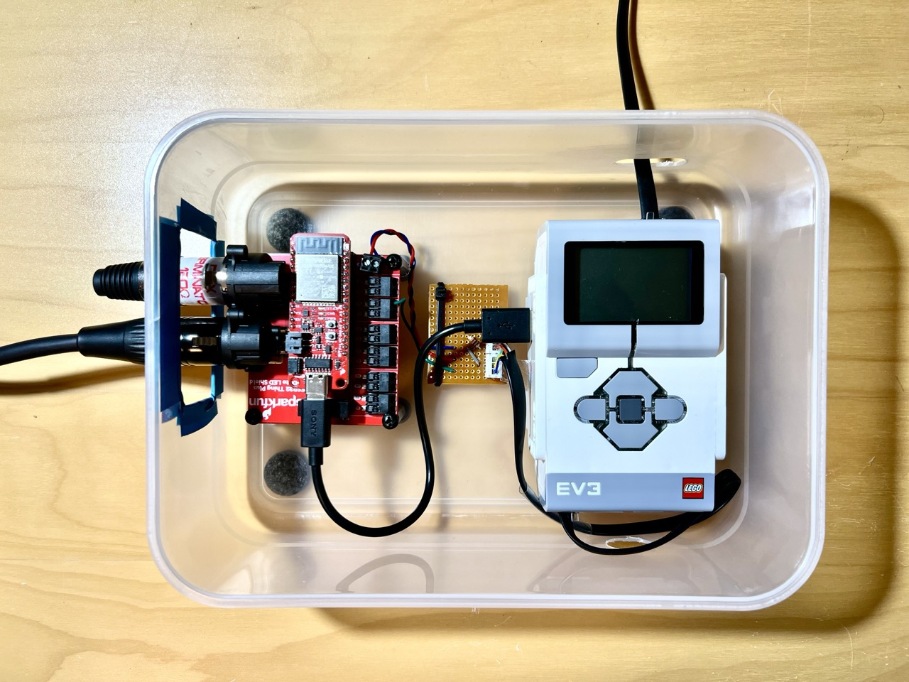

DMX512 to EV3 Brick bridge
===

This software is a bridge between a [DMX512 bus](https://en.wikipedia.org/wiki/DMX512) and an [Lego EV3 Mindstorms brick](https://en.wikipedia.org/wiki/Lego_Mindstorms_EV3).

In terms of hardware, it uses a [SparkFun ESP32 DMX to LED Shield](https://www.sparkfun.com/products/15110) and a [SparkFun Thing Plus - ESP32](https://www.sparkfun.com/products/15663).

It works as follows:

* Registers on the DMX bus as a receiver. The channel it listens to is hardcoded in the source code.
* If it detects a value above or below a certain threshold it writes a HIGH or LOW value to an output pin D0 of the DMX shield.
* All detected transitions on the DMX bus are written to the EV3 shield as described above as well an on the ESP32 serial port.
* Normally, between the DMX shield and the EV3 I put a small resistor circuit so that the bridge is seen as a touch sensor. But it doesn't need to be this way.
* The internal RGB LED of the ESP32 is used to show status. RED means that no data is being read from the DMX bus. Blicking between GREEN, BLUE and RED means that data is being produced.
* Also, the BLUE LED of the ESP32 is used to show if we are writing a zero or one to the D0 line of the shield.

Here's an image of the entire aparatus:

License
===
[Apache 2.0](LICENSE.txt)
